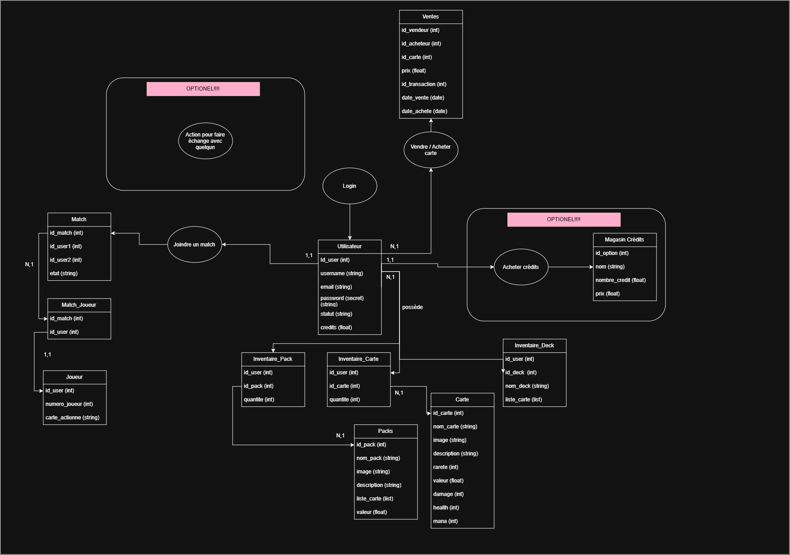

## Modèle de donnée initial

Chemin menant au diagramme entité relation: 

## Routes principales

## Routes nécessaires pour faire fonctionner l'application:

### Page du Login/Signup (`/auth`):
- POST /auth/signup — Crée un compte dans la base de données (nom d'utilisateur, email, mot de passe hashé avec bcrypt).
- POST /auth/login — Vérifie les identifiants et retourne un token JWT (expire après 2h).
- POST /auth/check-email — Lors de la création du compte, vérifie si l'email n'est pas déjà présent dans la base.
- GET /auth/whoAmI — (protégée, `checkAuth`) Retourne les infos de l'utilisateur connecté.
- PUT /auth/makeMeAdmin — (protégée, `checkAuth`) Route temporaire de test qui donne le statut admin à l'utilisateur connecté, à retirer une fois la gestion des rôles finalisée.

### Page Catalogue des Cartes (`/collection`):
- GET /collection/all — (protégée, `checkAuth`) Retourne toutes les cartes du catalogue.
- GET /collection/:id — (protégée, `checkAuth`) Retourne une carte spécifique du catalogue.
- POST /collection/card — (admin seulement, `checkAdmin`) Ajoute une nouvelle carte au catalogue (champs validés avec express-validator).
- PATCH /collection/:id — (admin seulement, `checkAdmin`) Modifie une carte existante.
- DELETE /collection/:id — (admin seulement, `checkAdmin`) Supprime une carte du catalogue.

### Page Inventaire / Decks (`/inventory`):
- GET /inventory/cards — Retourne toutes les cartes que l'utilisateur possède, avec leur quantité.
- GET /inventory/decks — Retourne la liste des decks de l'utilisateur (avec le total de cartes par deck).
- GET /inventory/decks/:id — Retourne le détail d'un deck spécifique (cartes incluses), pour le jouer en match.
- POST /inventory/decks — Crée un nouveau deck (nom requis, maximum 30 caractères).
- PATCH /inventory/decks/:id — Renomme un deck existant.
- DELETE /inventory/decks/:id — Supprime un deck.
- POST /inventory/decks/:id/cards/:idCarte — Ajoute une quantité d'une carte de l'inventaire dans un deck (vérifie que le joueur possède assez de cette carte).
- DELETE /inventory/decks/:id/cards/:idCarte — Retire une carte d'un deck.

### Routes additionnelles (sans préfixe commun, définies dans `routes/carte.js` et `routes/inventaire.js`):
- GET /api/card/:id — Retourne une carte spécifique (route simplifiée, redondante avec /collection/:id).
- GET /api/inventaire/:id_user — Retourne l'inventaire brut d'un utilisateur selon son id.
- POST /api/inventaire/:id_user/:id_carte — Ajoute une carte à l'inventaire d'un utilisateur.
- DELETE /api/inventaire/:id_user/:id_carte — Supprime une carte de l'inventaire d'un utilisateur.

### Routes de diagnostic (`app.js`):
- GET / — Vérifie que l'API est en ligne.
- GET /health — Healthcheck simple (utilisé par le CI/Docker).
- GET /api/db-check — Vérifie que la connexion à la base de données fonctionne.

### Autres fonctionalités d'utilisateurs:
- POST user/editCredits — Ajoute ou enlève des crédits du joueur sélectionné. Les crédits sont l'argent du site. Par exemple, si le joueur achète un booster pack, ça dépense de crédits.
- DELETE user/deleteAccount — Supprime le compte du database.

### Page Match:
- POST match/queue/addUserToQueue — Ajoute un utilisateur dans la liste de personnes qui veut faire un match contre un autre joueur.
- POST match/startMatch — Ajoute deux utilisateurs, puis démarre le match.    
- POST match/engageCard — Engage la carte dans le match.
- POST match/triggerAbility — Trigger l'ability d'une carte.
- POST match/stats/hpChangeCard — Route pour enlever ou ajouter des points de vies a la carte. Par exemple, quand la carte attaque l'autre carte, l'autre carte reçevera -5 points de vies.
- POST match/stats/hpChangePlayer — Route pour enlever ou ajouter des points de vies au joueur.

### Page Bazaar:
- GET market/bazaar/getPrices/:idCarte — Liste les détails des prix d'une carte spécifique.
- POST market/bazaar/createSellOrder — Ajoute une offre de vente pour un magasin. Enlève la carte de l'inventaire, et quand le buy est complèté, les crédits sont ajoutés automatiquement a l'inventaire du joueur.
- POST market/bazaar/buy — Conlue la vente, transactionne les crédits de l'acheteur au vendeur, et la carte du vendeur vient a l'acheteur. Ajoute aussi un log de transaction que les admins peuvent voir.
- DELETE market/bazaar/removeOffer — Enlève un offre. Quand l'offre de vente est annulé, retourne la carte au joueur.

### Middlewares (`middlewares/checkAuth.js`):
- checkAuth — Vérifie qu'un token JWT valide est fourni dans l'en-tête `Authorization`. Si valide, attache l'utilisateur à `req.user` et laisse passer la requête.
- checkAdmin — Vérifie qu'un token JWT valide est fourni et que l'utilisateur a le statut "admin". Si il est admin, laisse passer la requête. Sinon, retourne une erreur 403.

## Registre des décisions:

### Décision 1 | Quel modèle de base de données utiliser?
- **La question**: Quel modèle de base de données devrions nous utiliser? Continuer avec ce que nous avons appris et sommes à l'aise (MSSQL) ou apprendre un nouveau modèle qui serait possiblement plus simple à setup pour le docker (PostGreSQL)
- **Options envisagées**: MSSQL & PostGreSQL
- **Décision**: PostGreSQL
- **Raison**: L'apprentissage de ce nouveau modèle de base de donnée est assez similaire à celui que nous connaissons et son implémentation dans Docker est très simple, nous sauvant du temps à la longue.
- **Ce que ça coûte**: Apprendre les particularités de PostGreSQL, ce qui devrait être relativement simple surtout que nous connaissons les concepts des bases de données relationnelles.

### Décision 2 | Structure du projet
- **La question**: Comment structurer les récits et tâches à accomplir?
- **Options envisagées**: Épiques -> Récits -> Issue -> Sub-issue vs Issues -> Sub-issues
- **Décision**: É -> R -> I -> S-I
- **Raison**: L'ajout des épiques et récits rends les concepts plus clairs et permets une meilleure interprétation pour les décisions techniques lors du développement.
- **Ce que ça coûte**: Plus de développement des idées lors de l'élaboration du projet. Cela nous prends plus de temps que de faire des tickets/issues uniques.

### Décision 3 | Hosting
- **La question**: Quel service de hosting utiliser? 
- **Options envisagées**: Render ou Microsoft Azure
- **Décision**: Microsoft Azure
- **Raison**: Render n'offre pas assez de bonnes performances pour les besoins de notre projet donc nous allons aller vers Microsoft Azure.
- **Ce que ça coûte**: Le serveur ne pourra être hosté que lorsqu'on est étudiant et après nous devrons payer ou l'annuler.

## Nouvelles décisions prises durant le sprint 1

### Changements Sprint 0 -> 1
- Plusieurs nom de routes ont étés changées puisque nous utilisions des verbes dans le nom des routes. Après rétroaction du prof, nous avons suivi son conseil de laisser les méthodes HTTP parler d'elles mêmes.

### Décision 4 | Hiérarchie des fichiers
- **La question**: Comment organiser tous les fichiers
- **Options envisagées**: Une infinitée de différentes façons d'organiser les dossiers
- **Décision**: Serveur -> middlewares/ | routes/ | Router/ | tests/ | db/
                Client -> auth/ | components/ | pages/ | css/ | Routeur.jsx 
- **Raison**:   Organise les fichiers dans des catégories de tailles raisonnables, sans avoir des milliers de dossiers à naviguer.
- **Ce que ça coûte**: Une grosse perte de temps parce que Windows pense que "Pages" === "pages" donc il y avait une duplication des fichiers et des dossiers dans GitHub.

